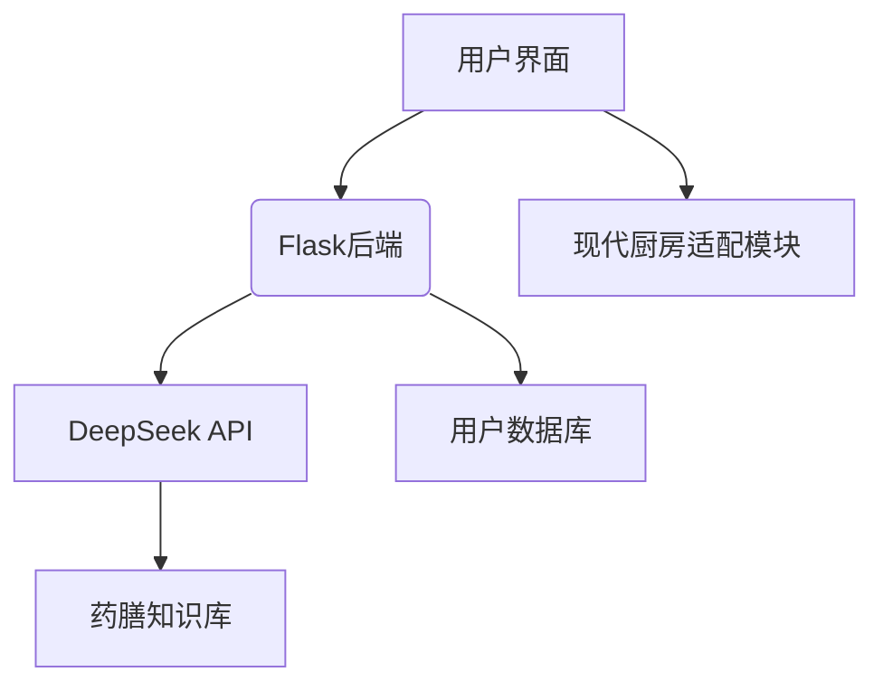

# 中医药膳智能推荐系统 - 技术实现路径

## 系统整体架构



## 关键技术实现

### 1. 自然语言处理层
- **症状解析引擎**：
  ```python
  def parse_symptoms(text):
      # 使用正则表达式提取关键症状
      patterns = {
          '头痛': r'头痛|头昏|头晕',
          '失眠': r'失眠|睡不好|难入睡'
      }
      return [k for k,v in patterns.items() if re.search(v, text)]
  ```

### 2. 药膳推荐算法
- 基于症状-药膳关联图谱
- 考虑体质因素权重
- 季节适应性调整系数

### 3. 现代化改良模块
- 传统工具映射表（如：砂锅→电压力锅）
- 原料替代知识库
- 步骤简化规则引擎

## 核心接口设计

### 推荐请求接口
```python
@app.route('/recommend', methods=['POST'])
def recommend():
    data = request.json
    user_input = data.get('input', '')
    
    # 获取原始推荐
    recipes = get_herbal_recipes(user_input)
    
    # 现代化处理
    modernized = []
    for recipe in recipes:
        improvements = modernize_recipe(recipe)
        modernized.append({
            **recipe,
            'improvements': improvements
        })
    
    return jsonify(modernized)
```

## 数据处理流程

1. **数据采集**：
   - 爬取权威中医药典籍
   - 中医专家人工标注

2. **知识图谱构建**：
   - 实体识别（药材、症状、体质）
   - 关系抽取（治疗、配伍、禁忌）

3. **模型训练**：
   - 基于DeepSeek微调
   - 中医领域语料训练
   - 推荐效果A/B测试

## 性能优化措施

1. **缓存机制**：
   - 高频查询结果缓存
   - 药材功效预加载

2. **异步处理**：
   - 复杂计算任务队列
   - 结果回调通知

3. **负载均衡**：
   - API请求分流
   - 自动扩容机制

## 安全与可靠性

1. 数据加密传输（HTTPS）
2. 敏感信息脱敏处理
3. 请求频率限制
4. 灾备方案（异地多活）
